# united-airline-secure-network✈️ United Airline — Multi-Cloud Zero-to-Hardened Secure Network

Repository: united-airline-secure-network
Author: Olagoldstx

Brand: SecureTheCloud.dev

A living, evolving enterprise architecture blueprint of a global airline—built from zero → hardened → resilient → AI-enabled across AWS, Azure, and GCP using Terraform, Zero Trust, strong IAM, and binder-style documentation.

🚀 Why This Repo Exists

Modern airlines are tech companies disguised as transportation companies.
United Airline (your simulated enterprise) is the perfect real-world scenario to demonstrate:

Multi-cloud architecture

Zero-Trust network hardening

Terraform modules at enterprise scale

Identity federation (Azure AD → AWS/GCP)

Multi-cloud KMS & data security

Global routing, resilience, and DR

SIEM + SOAR integration

Predictive analytics & sustainability dashboards

This repo is your public flagship project and portfolio centerpiece.

🗺️ United Airline Flight Map (Your Roadmap)

```mermaid
flowchart LR
  V0([V0 Foundation])
  V1([V1 Zero to Hardened])
  V2([V2 Egress & Inspection])
  V3([V3 Cross-Cloud Network])
  V4([V4 Identity Federation])
  V5([V5 Data & KMS])
  V6([V6 SIEM & SOAR])
  V7([V7 Resilience & DR])
  V8([V8 AI & Sustainability])

  V0 --> V1 --> V2 --> V3 --> V4 --> V5 --> V6 --> V7 --> V8
```

---

Each “Volume” is theory + lab + binder PDF, forming your living knowledge base.

📚 Living Knowledge Base (Volumes & Status)
Volume	Title	Theory (docs/theory)	Lab (labs)	Binder PDF	Status
V0	Foundation	volume0-united-airline-foundation.md	Optional	PDF	✅
V1	Zero to Hardened (AWS Hub)	volume1-zero-to-hardened-aws-hub.md	labs/volume1-aws-hub/	PDF	🏗️
V2	Egress & Inspection	volume2-egress-inspection.md	labs/volume2-egress-inspection/	PDF	⏳
V3	Cross-Cloud Network	volume3-cross-cloud-network.md	labs/volume3-cross-cloud-network/	PDF	⏳
V4	Identity Federation	volume4-identity-federation.md	labs/volume4-identity-federation/	PDF	⏳
V5	Data Security & KMS	volume5-data-kms.md	labs/volume5-data-kms/	PDF	⏳
V6	SIEM & SOAR	volume6-siem-soar.md	labs/volume6-siem-soar/	PDF	⏳
V7	Resilience & DR	volume7-resilience-dr.md	labs/volume7-resilience-dr/	PDF	⏳
V8	AI & Sustainability Analytics	volume8-ai-sustainability.md	labs/volume8-ai-sustainability/	PDF	⏳
🧩 Repository Structure (Living — Expands with Every Volume)
united-airline-secure-network/
├─ docs/
│  ├─ theory/
│  ├─ binder/
│  └─ architecture/
│
├─ labs/
│  ├─ volume1-aws-hub/
│  ├─ volume2-egress-inspection/
│  ├─ volume3-cross-cloud-network/
│  └─ ...
│
├─ terraform/
│  ├─ envs/
│  │  ├─ aws-hub/
│  │  ├─ azure-hub/
│  │  ├─ gcp-hub/
│  └─ modules/
│     ├─ aws/
│     ├─ azure/
│     └─ gcp/
│
├─ diagrams/
│  ├─ flight-map.mmd
│  ├─ v1-aws-hub.mmd
│  └─ ...
│
└─ policy/
   ├─ network-baseline.rego
   └─ compliance/

🧪 Lab Spotlight — Volume 1 (Zero to Hardened AWS Hub)

Objective: Build a fully private, logging-heavy AWS Hub VPC with Zero-Trust defaults.

Quickstart
cd labs/volume1-aws-hub/terraform/envs/aws-hub

terraform init
terraform plan
terraform apply

What You Deploy

Private-only VPC (no IGW, no public subnets)

Three-tier subnets (app/data/mgmt)

VPC Flow Logs → CloudWatch

DNS Resolver endpoints (prep for cross-cloud routing)

Zero-trust route posture (no default egress)

This is your security anchor for all future volumes.

👨🏽‍🏫 Binder Philosophy

Each volume includes:

🧠 1. Theory

Textbook-quality explanation, diagrams, analogies, threat models.

🧪 2. Hands-on Lab

Terraform modules + CLI walkthroughs.

📘 3. Binder PDF

Print-ready deliverable (for clients or course creation).
Includes:

Errors & Fixes

Concept Reflection

Security Justification

🧑‍✈️ Who This Repo Is For

Employers → shows full enterprise architecture skill

Students → structured roadmap + hands-on

Consulting clients → exportable secure network template

Your brand → flagship SecureTheCloud project
