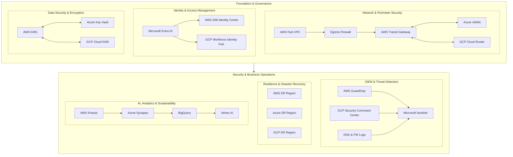

  

## 📚 Volumes 0–8

| Vol | Title                             | Theory                                           | Lab                                            |
|-----|-----------------------------------|--------------------------------------------------|------------------------------------------------|
| V0  | Foundation                        | docs/theory/volume0-united-airline-foundation.md | —                                              |
| V1  | Zero-to-Hardened AWS Hub          | docs/theory/volume1-zero-to-hardened-aws-hub.md  | labs/volume1-aws-hub/                          |
| V2  | Egress Firewall & Inspection      | docs/theory/volume2-egress-inspection.md         | labs/volume2-egress-inspection/                |
| V3  | Cross-Cloud Network               | docs/theory/volume3-cross-cloud-network.md       | labs/volume3-cross-cloud-network/              |
| V4  | Identity Federation               | docs/theory/volume4-identity-federation.md       | labs/volume4-identity-federation/              |
| V5  | Multi-Cloud KMS & Data Security   | docs/theory/volume5-data-kms.md                  | labs/volume5-data-kms/                         |
| V6  | SIEM & SOAR                       | docs/theory/volume6-siem-soar.md                 | labs/volume6-siem-soar/                        |
| V7  | Resilience & DR                   | docs/theory/volume7-resilience-dr.md             | labs/volume7-resilience-dr/                    |
| V8  | AI, Analytics & Sustainability    | docs/theory/volume8-ai-sustainability.md         | labs/volume8-ai-sustainability/                |

---

## 📁 Directory Structure

---

# ✈️ United Airline – Multi-Cloud Secure Architecture (Volumes 0–8)

A complete **airline-style** enterprise architecture across **AWS, Azure, and GCP**, built as a teaching, portfolio, and consulting asset for **SecureTheCloud.dev**.

---

## 📚 Table of Contents

- [Architecture Overview](#-architecture-overview)
- [Quick Navigation](#-quick-navigation)
- [Volumes 0–8](#-volumes-0-8)
- [Directory Structure](#-directory-structure)
- [Security & Support](#-security--support)
- [About](#-about)

---

## 🗺 Architecture Overview

---

  

  

  

  

📚 Volumes 0–8

Each volume has:

📘 Theory — textbook-style explanation

🧪 Lab — Terraform + scripts

🖼 Diagrams — Mermaid/visuals

📝 Binder — “Errors & Fixes” notes

Vol	Title	Theory	Lab
V0	Foundation	docs/theory/volume0-united-airline-foundation.md	—
V1	Zero-to-Hardened AWS Hub	docs/theory/volume1-zero-to-hardened-aws-hub.md	labs/volume1-aws-hub/
V2	Egress Firewall & Inspection	docs/theory/volume2-egress-inspection.md	labs/volume2-egress-inspection/
V3	Cross-Cloud Network (AWS/Azure/GCP)	docs/theory/volume3-cross-cloud-network.md	labs/volume3-cross-cloud-network/
V4	Identity Federation (Entra → AWS/GCP)	docs/theory/volume4-identity-federation.md	labs/volume4-identity-federation/
V5	Multi-Cloud KMS & Data Security	docs/theory/volume5-data-kms.md	labs/volume5-data-kms/
V6	SIEM & SOAR	docs/theory/volume6-siem-soar.md	labs/volume6-siem-soar/
V7	Resilience & DR	docs/theory/volume7-resilience-dr.md	labs/volume7-resilience-dr/
V8	AI, Analytics & Sustainability	docs/theory/volume8-ai-sustainability.md	labs/volume8-ai-sustainability/
📁 Directory Structure
united-airline-secure-network/
├─ docs/
│  ├─ theory/          # All volume theory chapters
│  ├─ binder/          # (Future) master PDFs
│  └─ architecture/    # Diagrams & mermaid files
├─ labs/
│  ├─ volume1-aws-hub/
│  ├─ volume2-egress-inspection/
│  ├─ volume3-cross-cloud-network/
│  ├─ volume4-identity-federation/
│  ├─ volume5-data-kms/
│  ├─ volume6-siem-soar/
│  ├─ volume7-resilience-dr/
│  └─ volume8-ai-sustainability/
├─ diagrams/
├─ terraform/
└─ docs/branding/securethecloud.png

🔐 Security & Support

See:

SECURITY.md
 – how to responsibly report vulnerabilities

SUPPORT.md
 – how to get help, training, or consulting
(GitHub issues, email channels, response times)

🧠 About

Created by Ola Omoniyi (Olagoldstx)
Founder — SecureTheCloud.dev
Multi-Cloud Security Architect (AWS | Azure | GCP | Kubernetes | Zero-Trust | DevSecOps)

This repository is part of the SecureTheCloud.dev Airline Series — built to be:

A teaching tool

A portfolio centerpiece

A consulting accelerator

A living multi-cloud security reference
