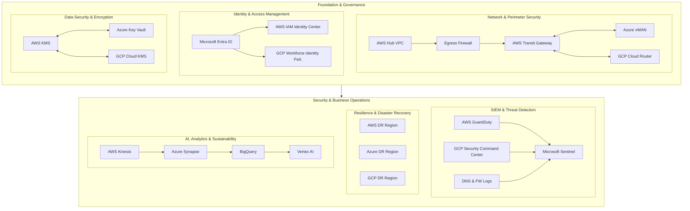

  

---

---

## 📁 Directory Structure

---

# ✈️ United Airline – Multi-Cloud Secure Architecture (Volumes 0–8)

A complete **airline-style** enterprise architecture across **AWS, Azure, and GCP**, built as a teaching, portfolio, and consulting asset for **SecureTheCloud.dev**.

---

## 📚 Table of Contents

- [Architecture Overview](#-architecture-overview)
- [Quick Navigation](#-quick-navigation)
- [Volumes 0–8](#-volumes-0-8)
- [Directory Structure](#-directory-structure)
- [Security & Support](#-security--support)
- [About](#-about)

---

## 🗺 Architecture Overview

---

  

  

  

  

## 📚 Volumes 0–8

<em>Select a module to jump into the theory or lab.</em>

---

### 🧭 **Volume 0 — Foundation**  
####  Cloud Concepts · Airline Digital Basics  
A lightweight intro to multi-cloud, airline digital systems, Zero-Trust, and this entire architecture series.

  

---

### 🛡️ **Volume 1 — Zero-to-Hardened AWS Hub**  
####  AWS · Private VPC · Segmentation  
Build a **private-only hub** with VPC segmentation, DNS controls, and baseline observability (Flow Logs).

  
  

---

### 🔥 **Volume 2 — Egress Firewall & Deep Inspection**  
####  AWS · Network Firewall · GWLB  
Centralized egress inspection with AWS Network Firewall, Suricata rules, FQDN allowlists, and DNS filtering.

  
  

---

### 🌍 **Volume 3 — Cross-Cloud Network (AWS ↔ Azure ↔ GCP)**  
####  Multi-Cloud Routing · TGW · vWAN · Cloud Router  
Create a private global mesh using IPSec + BGP: AWS TGW ↔ Azure vWAN ↔ GCP Cloud Router.

  
  

---

### 🔐 **Volume 4 — Identity Federation (Entra → AWS/GCP)**  
####  Azure Entra ID · SAML · SCIM · OIDC  
Unified workforce identity: Entra SSO → AWS IAM Identity Center + GCP Workforce Identity Federation.

  
  

---

### 🔒 **Volume 5 — Multi-Cloud KMS & Data Security**  
####  AWS KMS · Azure Key Vault · GCP KMS  
Unified key hierarchy, envelope encryption, rotation, and data protection across AWS, Azure, and GCP.

  
  

---

### 👁️ **Volume 6 — SIEM & SOAR**
####  Sentinel · GuardDuty · SCC · Automation  
Centralized logging + cross-cloud SIEM + automated response with Logic Apps, AWS API, GCP API.

  
  

---

### 🌪️ **Volume 7 — Resilience & Disaster Recovery**
####  Multi-Region · Multi-Cloud · Chaos Engineering  
Airline-grade continuity: DNS failover, KMS multi-region replication, cross-cloud DR, chaos testing.

  
  

---

### 🤖 **Volume 8 — AI, Analytics & Sustainability**
####  Vertex AI · BigQuery · Kinesis · Synapse  
Multi-cloud AI pipeline: ingestion → lake → Synapse → BigQuery → Vertex AI + CO₂/fuel analytics.

  
  

 

---

📁 Directory Structure
united-airline-secure-network/
├─ docs/
│  ├─ theory/          # All volume theory chapters
│  ├─ binder/          # (Future) master PDFs
│  └─ architecture/    # Diagrams & mermaid files
├─ labs/
│  ├─ volume1-aws-hub/
│  ├─ volume2-egress-inspection/
│  ├─ volume3-cross-cloud-network/
│  ├─ volume4-identity-federation/
│  ├─ volume5-data-kms/
│  ├─ volume6-siem-soar/
│  ├─ volume7-resilience-dr/
│  └─ volume8-ai-sustainability/
├─ diagrams/
├─ terraform/
└─ docs/branding/securethecloud.png

🔐 Security & Support

See:

SECURITY.md
 – how to responsibly report vulnerabilities

SUPPORT.md
 – how to get help, training, or consulting
(GitHub issues, email channels, response times)

🧠 About

Created by Ola Omoniyi (Olagoldstx)
Founder — SecureTheCloud.dev
Multi-Cloud Security Architect (AWS | Azure | GCP | Kubernetes | Zero-Trust | DevSecOps)

This repository is part of the SecureTheCloud.dev Airline Series — built to be:

A teaching tool

A portfolio centerpiece

A consulting accelerator

A living multi-cloud security reference
