## 🧭 United Airline Flight Map (Volumes 0–8)

```mermaid
flowchart LR
  V0([V0 Foundation ✅])
  V1([V1 Zero to Hardened ✅])
  V2([V2 Egress & Inspection ✅])
  V3([V3 Cross-Cloud Network ✅])
  V4([V4 Identity Federation ✅])
  V5([V5 Data & KMS ✅])
  V6([V6 SIEM & SOAR ✅])
  V7([V7 Resilience & DR ✅])
  V8([V8 AI & Sustainability ✅])

  V0 --> V1 --> V2 --> V3 --> V4 --> V5 --> V6 --> V7 --> V8
```


---

### 📚 Living Knowledge Base (All Volumes Done)

## 📚 United Airline Binder – Volumes & Status

| Volume | Title                         | Theory                                           | Lab                                            | Binder PDF                                          | Status |
|--------|-------------------------------|--------------------------------------------------|------------------------------------------------|-----------------------------------------------------|--------|
| V0     | Foundation                    | `docs/theory/volume0-united-airline-foundation.md`            | (optional)                                     | `docs/binder/United_Airline_Binder_Volumes_1_4.pdf` | ✅     |
| V1     | Zero to Hardened (AWS Hub)    | `docs/theory/volume1-zero-to-hardened-aws-hub.md`             | `labs/volume1-aws-hub/`                        | `docs/binder/United_Airline_Binder_Volumes_1_4.pdf` | ✅     |
| V2     | Egress & Inspection           | `docs/theory/volume2-egress-inspection.md`                    | `labs/volume2-egress-inspection/`              | `docs/binder/United_Airline_Binder_Volumes_1_4.pdf` | ✅     |
| V3     | Cross-Cloud Network           | `docs/theory/volume3-cross-cloud-network.md`                  | `labs/volume3-cross-cloud-network/`            | `docs/binder/United_Airline_Binder_Volumes_1_4.pdf` | ✅     |
| V4     | Identity Federation           | `docs/theory/volume4-identity-federation.md`                  | `labs/volume4-identity-federation/`            | `docs/binder/United_Airline_Binder_Volumes_1_4.pdf` | ✅     |
| V5     | Data Security & KMS           | `docs/theory/volume5-data-kms.md`                             | `labs/volume5-data-kms/`                       | `docs/binder/United_Airline_Binder_Volumes_5_8.pdf` | ✅     |
| V6     | SIEM & SOAR                   | `docs/theory/volume6-siem-soar.md`                            | `labs/volume6-siem-soar/`                      | `docs/binder/United_Airline_Binder_Volumes_5_8.pdf` | ✅     |
| V7     | Resilience & DR               | `docs/theory/volume7-resilience-dr.md`                        | `labs/volume7-resilience-dr/`                  | `docs/binder/United_Airline_Binder_Volumes_5_8.pdf` | ✅     |
| V8     | AI & Sustainability Analytics | `docs/theory/volume8-ai-sustainability.md`                    | `labs/volume8-ai-sustainability/`              | `docs/binder/United_Airline_Binder_Volumes_5_8.pdf` | ✅     |

---

## 🗺️ United Airline – End-to-End Architecture (Volumes 1–8)

```mermaid
flowchart TB

%% LAYER 1–3: NETWORK
subgraph Network["Network & Perimeter (V1–V3)"]
  HUB[AWS Hub VPC (V1)]
  FW[Egress Firewall + NFW + GWLB (V2)]
  TGW[AWS TGW]
  VWAN[Azure vWAN Hub]
  GCPR[GCP Cloud Router]
  HUB --> FW --> TGW
  TGW <---> VWAN
  TGW <---> GCPR
end

%% LAYER 4: IDENTITY
subgraph Identity["Identity & Access (V4)"]
  ENTRA[Microsoft Entra ID]
  AWS_SSO[AWS IAM Identity Center]
  GCP_WIF[GCP Workforce Identity Federation]
  ENTRA --> AWS_SSO
  ENTRA --> GCP_WIF
end

%% LAYER 5: DATA
subgraph Data["Data Security & KMS (V5)"]
  AWS_KMS[AWS KMS]
  AZ_KV[Azure Key Vault]
  GCP_KMS[GCP Cloud KMS]
  AWS_KMS <---> AZ_KV
  AWS_KMS <---> GCP_KMS
end

%% LAYER 6: DETECTION
subgraph Detection["SIEM & SOAR (V6)"]
  SENT[Microsoft Sentinel]
  GD[GuardDuty]
  SCC[GCP Security Command Center]
  FWLOG[Firewall & DNS Logs]
  GD --> SENT
  SCC --> SENT
  FWLOG --> SENT
end

%% LAYER 7: RESILIENCE
subgraph Resilience["Resilience & DR (V7)"]
  AWS_DR[AWS DR Region]
  AZ_DR[Azure DR (AKS)]
  GCP_DR[GCP DR (GKE)]
  TGW --> AWS_DR
  VWAN --> AZ_DR
  GCPR --> GCP_DR
end

%% LAYER 8: AI
subgraph AI["AI, Analytics & Sustainability (V8)"]
  KINESIS[AWS Kinesis / Glue]
  S3[S3 Data Lake]
  SYN[Synapse / Power BI]
  BQ[BigQuery]
  VERTEX[Vertex AI]
  KINESIS --> S3 --> SYN
  S3 --> BQ --> VERTEX
end

ENTRA --> AWS_KMS
ENTRA --> AZ_KV
ENTRA --> GCP_KMS

AWS_KMS --> S3
AZ_KV --> SYN
GCP_KMS --> BQ

SENT --> Resilience
AI --> SENT
```
