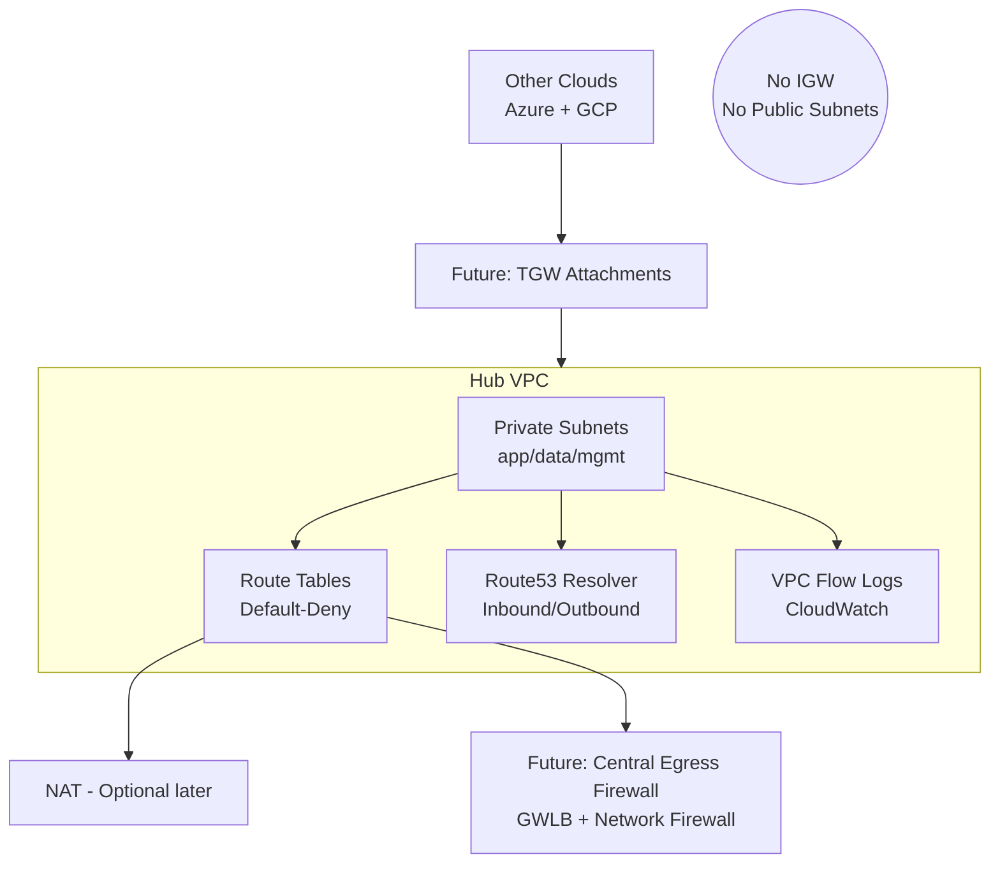

✈️ United Airline — Volume 1
Zero-to-Hardened: AWS Hub Network Foundation

SecureTheCloud.dev — Binder Series

🧭 1. Purpose of This Volume

Volume 1 establishes the security anchor for the entire United Airline multi-cloud architecture.
Before we connect Azure, GCP, IAM federation, KMS, SIEM, or analytics, we must create a hardened AWS Hub that enforces:

Private-only networking

Zero Trust at the network perimeter

Least-privilege routing between tiers

Auditable traffic visibility

DNS control

Egress lockdown

Terraform modularity

This hub represents the primary cloud “airport” in United Airline’s digital network.
All traffic, routes, identities, egress, and future multi-cloud paths will pass through this hub.

🛫 2. Analogy: The Airport Security Concept

To make this easy to understand, think of the AWS Hub as O’Hare International Airport (ORD) — United’s primary real-world hub.

Airline Concept	Digital Equivalent
Airport	AWS Hub VPC
Terminals	Subnets (app/data/mgmt)
TSA Checkpoints	Network firewall, route controls
Runways	Routing tables
Air Traffic Control	IAM policies + DNS
Ground Crew Operations	Flow logs + monitoring
VIP Lanes	PrivateLink / service endpoints
No-public-entry zones	No IGW + no public subnets

Just like O’Hare:

Everything lands here

Everything passes security here

Everything departs through controlled routes

That’s exactly what we’re building.

🧱 3. Architectural Overview (AWS Hub)

Below is the architectural flow of the hardened Hub:

🛡️ 4. Security Principles Implemented
1) Zero Public Exposure

No IGW

No public subnets

No public EC2 IPs

No S3 public ACLs

No open SG rules
This enforces Zero External Blast Radius.

2) Default-Deny Routing

All route tables start with:

No 0.0.0.0/0 route
No internet path
No implicit traffic allowed

Outbound only works when you explicitly add:

NAT (temporary)

Firewall egress

Private endpoints

TGW routing

This prevents accidental data exfiltration.

3) Traffic Visibility Everywhere

We enable:

VPC Flow Logs (ALL)

DNS Query Logging

IAM logs (CloudTrail on by default)

Log retention policies

This ensures:

If a packet moves, we see it. If a packet leaves, we question it.

4) Centralized DNS

Route53 Resolver:

Inbound → other clouds/regions can resolve private names

Outbound → resolves to upstream hybrid DNS or forwarders

DNS is your first layer of Zero Trust.

5) Terraform-Driven Hub Modules

All resources are deployed with:

Reusable modules

Consistent tagging

OPA/Rego policy guardrails

Cross-cloud-ready outputs

The goal:

This hub should be rebuildable anywhere in minutes.

🧱 5. Components of the AWS Hub (V1)
✔ VPC (10.10.0.0/20)

Wide enough for multi-AZ

Segmented for multiple tiers

✔ 3-Tier Private Subnets

app — front services

data — RDS, DDB, S3 endpoints

mgmt — bastions, IAM, tooling

✔ No IGW

Absolute hardening requirement for Volume 1.
(The IGW would only come back through controlled egress firewall routing.)

✔ Route Tables

Each tier gets its own route table.

✔ Flow Logs

Sent to CloudWatch Logs → future SIEM integration (Volume 6).

✔ Resolver Endpoints

Prepare DNS for:

Azure vNet

GCP VPC

On-prem

EKS/containers

Service mesh mTLS

✔ Terraform OPA Policies

Example:

Block SG 0.0.0.0/0

Block public subnets

Block unencrypted resources

Block IAM wildcard

🧪 6. Hands-On Lab Summary (Terraform)

Location:
labs/volume1-aws-hub/terraform/envs/aws-hub/

Deploy:

terraform init
terraform plan
terraform apply

The module automatically builds:

Hub VPC

Private subnets

Route tables

Flow logs

Resolver endpoints

IAM roles

Tags

Outputs include:

VPC ID

Subnet IDs

Resolver IPs

NAT / future TGW attachment points

🧨 7. Threat Model (STRIDE)
Threat	Example in Airline Context	Mitigation Implemented
S – Spoofing	Fake service pretending to be airline backend	Private networking, SG Zero Trust
T – Tampering	Manipulating traffic between services	No public routes, encrypted paths
R – Repudiation	“I didn’t make that change”	IAM + CloudTrail + Flow Logs
I – Information Disclosure	S3 leakage, DB exfil	No IGW, no public ACLs
D – DoS	Overload of public endpoints	No public entry points exist
E – Elevation of Privilege	Jumping from app tier to data tier	Segmented subnets + route tables

Volume 1 eliminates entire categories of attack by removing the internet.

🧩 8. How Volume 1 Fits into the Larger Journey

Volume 1 lays the foundation for:

✔ Volume 2 — Egress Firewall

Traffic leaves AWS only through AWS Network Firewall + GWLB.

✔ Volume 3 — Cross-Cloud Network

TGW ↔ Azure vWAN ↔ GCP Router connections plug directly into this hub.

✔ Volume 4 — Identity Federation

Entra ID → IAM Identity Center mapped across hubs.

✔ Volume 5 — Multi-Cloud KMS

Shared encryption model centralizes keys across all environments.

✔ Volume 6 — SIEM & SOAR

Flow logs + CloudTrail feed into central detection.

✔ Volume 7 — Resilience

Multi-region failover uses this hub as Region-1 anchor.

✔ Volume 8 — AI Analytics

Hub is the ingestion point for baggage, aircraft telemetry, and customer analytics.

📝 9. Errors & Fixes (Binder Section)

Add your real lab notes here as you experiment:

Error	Root Cause	Fix
		
		

Keep this updated every time Terraform errors.
Your binder thrives on your mistakes, not perfection.

🔚 10. Summary

Volume 1 achieves a zero-trust hardened core:

No public exposure

No default egress

No accidental lateral movement

Full packet logging

Enterprise-ready DNS

Terraform modularization

Policy guardrails

Everything from here—Azure, GCP, KMS, firewalls, federation—will attach to this secure anchor.
